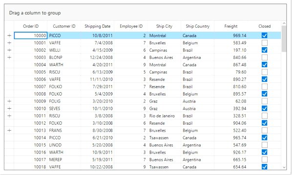

# How to Collapse the DetailsViewDataGrid inside the Groups in WinForms DataGrid?

This sample show cases how to collapse the `DetailsViewDataGrid` inside the groups in [WinForms DataGrid](https://www.syncfusion.com/winforms-ui-controls/datagrid) (SfDataGrid).

By default, `DetailsViewDataGrid` expanded state is maintain when group of `DataGrid` is collapsed. If we need to collapse the `DetailsViewDataGrid` when group of `DataGrid` is collapsed, this can be achieved by disabling the [IsExpanded](https://help.syncfusion.com/cr/windowsforms/Syncfusion.Data.RecordEntry.html#Syncfusion_Data_RecordEntry_IsExpanded) of `DetailsViewDataGrid` in [SfDataGrid.GroupExpanding](https://help.syncfusion.com/cr/windowsforms/Syncfusion.WinForms.DataGrid.SfDataGrid.html#Syncfusion_WinForms_DataGrid_SfDataGrid_GroupExpanding) event.

```C#
this.sfDataGrid1.GroupExpanding += SfDataGrid1_GroupExpanding;

private void SfDataGrid1_GroupExpanding(object sender, Syncfusion.WinForms.DataGrid.Events.GroupChangingEventArgs e)
{
    CollapseAllNestedGrids(e.Group);
}

void CollapseAllNestedGrids(Group group)
{
    if (group != null && group.Records != null)
    {
        foreach (var item in group.Records)
        {
            if (item.IsGroups == false)
                item.IsExpanded = false;
        }
    }
    if (group.Groups != null)
    {
        foreach (var item in group.Groups)
            CollapseAllNestedGrids(item);
    }
}
```

